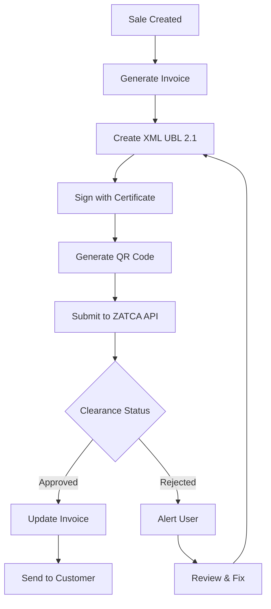
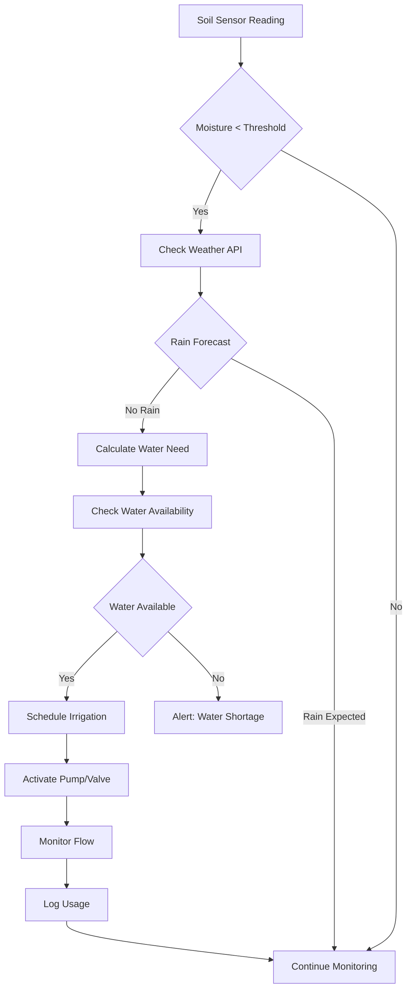
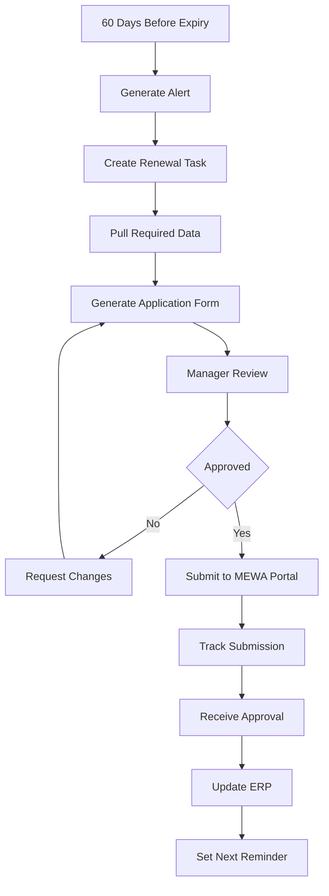

# Regulatory Workflows & GitHub Integration Guide

This document provides detailed regulatory workflow automation and identifies useful GitHub repositories for integration into your agricultural ERP system.

---

## Table of Contents

1. [Regulatory Workflow Automation](#regulatory-workflow-automation)
2. [Useful GitHub Repositories](#useful-github-repositories)
3. [Integration Strategies](#integration-strategies)
4. [Workflow Examples](#workflow-examples)
5. [Implementation Roadmap](#implementation-roadmap)

---

## Regulatory Workflow Automation

### MEWA Compliance Workflows

#### Workflow 1: Agricultural License Renewal

**Trigger**: 60 days before license expiry

**Automated Steps**:
1. **System Check** (Day 60 before expiry)
   - ERP generates alert to compliance officer
   - Auto-create renewal task in project management
   - Assign to: Agricultural License Officer

2. **Document Preparation** (Days 60-45)
   - System pulls required data:
     - Current production reports
     - Water usage logs
     - Land utilization records
   - Auto-generate renewal application form
   - Flag missing documents

3. **Review & Approval** (Days 45-30)
   - Department head reviews
   - System sends for internal approval workflow
   - Auto-notify stakeholders

4. **Submission** (Days 30-15)
   - Upload to MEWA portal: https://eservices.mewa.gov.sa/
   - System tracks submission status
   - Auto-generate payment if fees required

5. **Follow-up** (Days 15-0)
   - Daily status check on MEWA portal
   - Alert if no response received
   - Escalate to management if needed

6. **Receipt & Update** (Post-renewal)
   - Download renewed license
   - Update ERP with new expiry date
   - Set next renewal reminder

**ERP Modules Involved**:
- Compliance tracker
- Document management
- Task automation
- Alert system

#### Workflow 2: Quarterly Production Reporting

**Trigger**: Last day of each quarter

**Automated Steps**:
1. **Data Aggregation** (Auto)
   - Pull crop yields from production module
   - Calculate total production per crop
   - Compare with planned vs actual
   - Generate variance analysis

2. **Report Generation** (Auto)
   - Create MEWA-compliant report format
   - Include required metrics:
     - Area planted (hectares)
     - Crop varieties
     - Yield per hectare
     - Total production (tons)
     - Water consumption
     - Fertilizer/pesticide usage

3. **Internal Review** (Manual)
   - Farm manager reviews
   - Quality check by compliance officer
   - Sign-off by operations head

4. **Submission** (Auto-assisted)
   - Upload to MEWA portal
   - Track submission confirmation
   - Archive submitted report

5. **Response Tracking** (Auto)
   - Monitor for MEWA queries
   - Alert if inspection scheduled
   - Log any feedback

**Integration Point**: MEWA e-services API (if available)

---

### NCEC Environmental Compliance Workflows

#### Workflow 3: Environmental Monitoring & Reporting

**Trigger**: Monthly/Quarterly as per permit requirements

**Automated Steps**:
1. **Data Collection** (Continuous)
   - IoT sensors capture:
     - Water quality parameters
     - Soil test results
     - Air quality (if applicable)
     - Waste generation logs
   - Store in time-series database

2. **Analysis** (Auto)
   - Calculate compliance thresholds
   - Flag any exceedances
   - Generate trend analysis
   - Predict future compliance risks

3. **Report Creation** (Auto)
   - Compile data into NCEC format
   - Include:
     - Monitoring results
     - Compliance status
     - Corrective actions taken
     - Photos/evidence
   - Generate PDF report

4. **Review & Certification** (Manual)
   - Environmental officer reviews
   - Lab certifies test results
   - Management approval

5. **Submission** (Auto)
   - Upload to NCEC portal: https://eservices.ncec.gov.sa/
   - Track submission
   - Store confirmation

6. **Inspection Preparation** (Conditional)
   - If inspection scheduled:
     - Alert team
     - Prepare checklist
     - Organize documents
     - Schedule walkthrough

**IoT Integration**: Environmental sensors → ERP → NCEC portal

---

### ZATCA E-Invoicing Workflows

#### Workflow 4: E-Invoice Generation & Submission (Phase 2)

**Trigger**: Any sale/purchase transaction

**Automated Steps**:
1. **Invoice Creation** (Auto)
   - Transaction data from ERP
   - Generate invoice in standard format
   - Calculate VAT (15%)
   - Add required ZATCA fields

2. **XML Generation** (Auto)
   - Convert to UBL 2.1 XML format
   - Include:
     - Seller info (VAT number, CR)
     - Buyer info
     - Line items with VAT
     - Total amounts
     - UUID (unique identifier)

3. **Cryptographic Signing** (Auto)
   - Sign XML with CSR certificate
   - Generate hash
   - Create QR code with mandatory fields

4. **ZATCA Submission** (Auto - Phase 2)
   - Submit to ZATCA clearance API
   - Receive clearance status
   - Get clearance UUID
   - Update invoice with ZATCA response

5. **Customer Delivery** (Auto)
   - Send cleared invoice to customer
   - Include QR code
   - Archive in ERP

6. **Reporting** (Monthly)
   - Aggregate all invoices
   - Submit VAT return
   - Generate Zakat calculation

**GitHub Integration**: 
- ERPGulf/Saudi-E-Invoicing-Phase-2-2024 (25 stars)
- Beveren-Software-Inc/ZATCA_Integration (6 stars)

---

### GOSI Compliance Workflows

#### Workflow 5: Monthly GOSI Contribution Submission

**Trigger**: 1st of every month

**Automated Steps**:
1. **Payroll Calculation** (Auto)
   - Calculate gross wages for all employees
   - Separate Saudi/expat employees
   - Calculate contribution:
     - Saudi: Employee 10% + Employer 11.5% = 21.5%
     - Expat: Employer 2% (occupational hazards)

2. **Report Generation** (Auto)
   - Generate GOSI contribution file
   - Format: Excel/CSV as per GOSI specs
   - Include:
     - Employee ID numbers
     - Wage amounts
     - Contribution amounts
     - Employment dates

3. **Validation** (Auto)
   - Check against employee master
   - Verify wage calculations
   - Flag discrepancies

4. **Approval** (Manual)
   - HR manager reviews
   - Finance approves
   - Management sign-off

5. **Submission** (Auto)
   - Upload to GOSI portal: https://online.gosi.gov.sa/
   - Process payment through bank
   - Receive confirmation

6. **Reconciliation** (Auto)
   - Match payment with submission
   - Update employee records
   - Archive for audit

**Due Date**: 15th of following month
**Penalty**: 2% per month on late payments

---

### Qiwa Labor Compliance Workflows

#### Workflow 6: Wage Protection System (WPS) Compliance

**Trigger**: Monthly before salary payment

**Automated Steps**:
1. **Wage Calculation** (Auto)
   - Calculate salaries from time & attendance
   - Include:
     - Basic salary
     - Allowances
     - Overtime
     - Deductions
   - Generate payroll

2. **WPS File Creation** (Auto)
   - Create SIF (Salary Information File)
   - Format as per MOL specifications
   - Include:
     - Employee Iqama number
     - Salary components
     - Bank details
     - Payment method

3. **Bank Upload** (Auto)
   - Submit to approved bank
   - Via SADAD system
   - Batch payment processing

4. **MOL Reporting** (Auto)
   - Upload WPS file to Qiwa: https://qiwa.sa/
   - Report within 7 days of payment
   - Track submission status

5. **Confirmation** (Auto)
   - Receive WPS certificate
   - Verify all employees processed
   - Alert if any rejections

6. **Record Keeping** (Auto)
   - Archive payroll
   - Store WPS certificate
   - Update compliance tracker

**Critical**: Payments must be made by 7th of following month

---

## Useful GitHub Repositories

### 1. ZATCA E-Invoicing Integration

#### A. ERPGulf/Saudi-E-Invoicing-Phase-2-2024
**Stars**: 25 | **Language**: Python | **License**: Open Source

**Features**:
- Phase 2 ZATCA compliance
- XML generation (UBL 2.1)
- Cryptographic signing
- QR code generation
- API integration with ZATCA

**Integration Use**:
```python
# Install
git clone https://github.com/ERPGulf/Saudi-E-Invoicing-Phase-2-2024.git

# Use in ERPNext
# 1. Install as custom app
bench get-app https://github.com/ERPGulf/Saudi-E-Invoicing-Phase-2-2024.git
bench --site your-site install-app saudi_e_invoicing

# 2. Configure
- Add company CSR certificate
- Configure ZATCA credentials
- Map invoice fields
- Test with sandbox

# 3. Enable automation
- Auto-generate XML on invoice submission
- Auto-submit to ZATCA clearance
- Auto-update invoice with clearance status
```

**Why Use This**:
- Actively maintained (2024)
- Multi-company support
- ERPNext compatible
- Phase 2 compliant

#### B. Beveren-Software-Inc/ZATCA_Integration
**Stars**: 6 | **Language**: Python

**Features**:
- ERPNext app specifically for ZATCA
- Phase 1 & 2 support
- Invoice validation
- Compliance reporting

**Integration Use**:
Similar to above, install as ERPNext app

---

### 2. IoT Agricultural Monitoring

#### A. opensensor/growmax
**Stars**: 27 | **Language**: Python (MicroPython)

**Features**:
- 8-channel moisture sensing
- MOSFET pump control
- Environmental monitoring (CO2, temp, humidity, pH)
- Cloud integration (OpenSensor.io)
- Real-time data visualization

**Integration Use**:
```python
# Setup IoT Gateway
1. Deploy growmax firmware on automation boards
2. Configure sensors for your farm plots
3. Setup MQTT broker for data collection
4. Create ERPNext integration:

# ERPNext Custom Script
import frappe
import paho.mqtt.client as mqtt

def on_message(client, userdata, message):
    data = json.loads(message.payload)
    
    # Create sensor reading record
    doc = frappe.new_doc("Sensor Reading")
    doc.plot_id = data['plot_id']
    doc.moisture_level = data['moisture']
    doc.temperature = data['temperature']
    doc.humidity = data['humidity']
    doc.timestamp = now()
    doc.insert()
    
    # Trigger irrigation if needed
    if data['moisture'] < threshold:
        trigger_irrigation(data['plot_id'])

# Connect MQTT
client = mqtt.Client()
client.on_message = on_message
client.connect("your-mqtt-broker", 1883)
client.subscribe("farm/sensors/#")
```

**Why Use This**:
- Production-ready firmware
- Greenhouse automation
- Multiple sensor support
- Scalable architecture

#### B. Smart-Crop-Monitoring-System
**Stars**: 3 | **Language**: Python | **Topics**: IoT, ML

**Features**:
- Real-time data collection (temp, humidity, NPK)
- Soil moisture prediction (ML model)
- Fertilizer recommendations
- ThingsBoard dashboard
- MQTT protocol

**Integration Use**:
1. Deploy on Raspberry Pi at farm locations
2. Collect sensor data
3. Push to ERPNext via API
4. Use ML predictions for planning

---

### 3. Crop Yield Prediction

#### A. cleipski/CropPredict
**Stars**: 64 | **Language**: Jupyter Notebook

**Features**:
- Machine learning for yield prediction
- Historical data analysis
- Weather pattern integration
- Jupyter notebooks for training

**Integration Use**:
```python
# In ERPNext, create scheduled job
import frappe
import pandas as pd
from crop_predict import YieldPredictor

def predict_seasonal_yield():
    # Get historical data
    data = frappe.db.sql("""
        SELECT 
            crop_type,
            area_hectares,
            avg(temperature) as temp,
            avg(rainfall) as rain,
            avg(yield_per_hectare) as yield
        FROM `tabCrop Production`
        WHERE harvest_date > DATE_SUB(NOW(), INTERVAL 5 YEAR)
        GROUP BY crop_type, YEAR(harvest_date)
    """, as_dict=1)
    
    # Train model
    predictor = YieldPredictor()
    predictor.train(data)
    
    # Predict next season
    upcoming = frappe.db.get_all("Crop Plan",
        filters={"status": "Planned"},
        fields=["name", "crop_type", "area_hectares"]
    )
    
    for plan in upcoming:
        prediction = predictor.predict(plan)
        frappe.db.set_value("Crop Plan", plan.name, 
            "predicted_yield", prediction)
```

**Why Use This**:
- Research-based algorithms
- Proven results
- Easy to integrate
- Customizable models

#### B. Crop-Yield-Prediction-Under-Climate-Change-Scenarios
**Stars**: 31 | **Language**: Python

**Features**:
- Ensemble ML techniques
- Climate change scenarios
- Temperature, rainfall, CO₂ integration
- Soil property analysis

**Integration Use**:
- Enhanced yield predictions
- Long-term planning
- Risk assessment
- Scenario modeling

---

### 4. Water Management & Irrigation

#### A. Smart-Irrigation (BHUMIKA-VV)
**Language**: Python

**Features**:
- Weather API integration (OpenWeatherMap)
- Automated irrigation control
- Sensor data processing
- Remote monitoring
- Cloud-based control

**Integration Use**:
```python
# ERPNext scheduled task
import frappe
import requests
from datetime import datetime, timedelta

def check_irrigation_needs():
    # Get weather forecast
    api_key = frappe.db.get_single_value("Farm Settings", "weather_api_key")
    location = frappe.db.get_single_value("Farm Settings", "location")
    
    weather = requests.get(
        f"https://api.openweathermap.org/data/2.5/forecast?q={location}&appid={api_key}"
    ).json()
    
    # Check rainfall forecast
    rain_expected = any(
        forecast.get('rain', {}).get('3h', 0) > 5 
        for forecast in weather['list'][:8]  # Next 24 hours
    )
    
    if not rain_expected:
        # Get soil moisture from sensors
        plots = frappe.db.get_all("Farm Plot",
            filters={"irrigation_enabled": 1},
            fields=["name", "moisture_sensor_id"]
        )
        
        for plot in plots:
            moisture = get_sensor_reading(plot.moisture_sensor_id)
            if moisture < plot.irrigation_threshold:
                schedule_irrigation(plot.name, weather)
```

**Why Use This**:
- Weather-based scheduling
- Water conservation
- Automated control
- Cost reduction

---

## Integration Strategies

### Strategy 1: Direct API Integration

**Best For**: ZATCA, GOSI, MEWA (if APIs available)

**Implementation**:
```python
# Create API connector in ERPNext
class GovtAPIConnector:
    def __init__(self, service):
        self.service = service
        self.credentials = frappe.get_doc("Govt API Credentials", service)
    
    def submit_data(self, data):
        response = requests.post(
            self.credentials.api_endpoint,
            json=data,
            headers=self.get_auth_headers(),
            timeout=30
        )
        return response.json()
    
    def get_auth_headers(self):
        # OAuth2 or API Key authentication
        return {
            'Authorization': f'Bearer {self.get_token()}',
            'Content-Type': 'application/json'
        }
```

### Strategy 2: MQTT for IoT Sensors

**Best For**: Agricultural sensors, environmental monitoring

**Implementation**:
```python
# Setup MQTT listener in ERPNext
import paho.mqtt.client as mqtt
import frappe

class IoTDataCollector:
    def __init__(self):
        self.client = mqtt.Client()
        self.client.on_connect = self.on_connect
        self.client.on_message = self.on_message
        
    def on_connect(self, client, userdata, flags, rc):
        # Subscribe to all farm sensors
        client.subscribe("farm/+/sensors/#")
        
    def on_message(self, client, userdata, msg):
        topic_parts = msg.topic.split('/')
        plot_id = topic_parts[1]
        sensor_type = topic_parts[3]
        
        # Store in ERPNext
        doc = frappe.new_doc("Sensor Reading")
        doc.plot_id = plot_id
        doc.sensor_type = sensor_type
        doc.value = float(msg.payload)
        doc.reading_time = now()
        doc.insert(ignore_permissions=True)
        frappe.db.commit()
```

### Strategy 3: File-Based Integration

**Best For**: GOSI submissions, WPS files, bulk uploads

**Implementation**:
```python
# Generate GOSI contribution file
def generate_gosi_file(month, year):
    employees = frappe.db.sql("""
        SELECT 
            e.name, e.iqama_number,
            s.gross_pay, s.basic_salary
        FROM `tabEmployee` e
        JOIN `tabSalary Slip` s ON s.employee = e.name
        WHERE MONTH(s.posting_date) = %s 
        AND YEAR(s.posting_date) = %s
        AND e.employment_type = 'Saudi'
    """, (month, year), as_dict=1)
    
    # Create Excel file per GOSI format
    wb = openpyxl.Workbook()
    ws = wb.active
    
    # Headers
    ws.append(['Iqama', 'Name', 'Wage', 'Employee Contribution', 
               'Employer Contribution', 'Total'])
    
    for emp in employees:
        employee_cont = emp.gross_pay * 0.10
        employer_cont = emp.gross_pay * 0.115
        ws.append([
            emp.iqama_number,
            emp.name,
            emp.gross_pay,
            employee_cont,
            employer_cont,
            employee_cont + employer_cont
        ])
    
    # Save and upload
    filename = f"GOSI_{month}_{year}.xlsx"
    wb.save(filename)
    return filename
```

### Strategy 4: Webhook Integration

**Best For**: Real-time updates, event-driven workflows

**Implementation**:
```python
# Receive webhooks from MEWA/NCEC
@frappe.whitelist(allow_guest=True)
def mewa_webhook():
    data = json.loads(frappe.request.data)
    
    if data.get('event_type') == 'license_approved':
        # Update license in ERP
        license_doc = frappe.get_doc("Agricultural License", 
            data['application_id'])
        license_doc.status = "Approved"
        license_doc.license_number = data['license_number']
        license_doc.expiry_date = data['expiry_date']
        license_doc.save()
        
        # Notify team
        notify_users("License Approved", license_doc)
        
    elif data.get('event_type') == 'inspection_scheduled':
        # Create inspection task
        create_inspection_task(data)
        
    return {'status': 'success'}
```

---

## Workflow Examples

### Example 1: End-to-End ZATCA Invoice Workflow



### Example 2: Irrigation Automation Workflow



### Example 3: License Renewal Automation



---

## Implementation Roadmap

### Phase 1: Core Workflow Automation (Weeks 1-4)

**Week 1-2: ZATCA E-Invoicing**
- [ ] Install ERPGulf/Saudi-E-Invoicing-Phase-2-2024
- [ ] Configure company certificates
- [ ] Test with ZATCA sandbox
- [ ] Train finance team
- [ ] Go live with Phase 2 compliance

**Week 3-4: GOSI & WPS Integration**
- [ ] Build GOSI file generator
- [ ] Integrate with payroll module
- [ ] Setup WPS bank connection
- [ ] Create Qiwa reporting integration
- [ ] Test end-to-end payroll workflow

### Phase 2: Environmental & Agricultural Compliance (Weeks 5-8)

**Week 5-6: MEWA Integration**
- [ ] Build MEWA reporting module
- [ ] Automate production reports
- [ ] Create license renewal workflow
- [ ] Setup document management
- [ ] Test with sample submissions

**Week 6-8: NCEC Compliance**
- [ ] Deploy environmental sensors
- [ ] Build data collection pipeline
- [ ] Create NCEC report generator
- [ ] Setup alert system for exceedances
- [ ] Test monitoring workflow

### Phase 3: IoT & Smart Agriculture (Weeks 9-16)

**Week 9-12: Sensor Network Deployment**
- [ ] Install opensensor/growmax boards
- [ ] Deploy soil moisture sensors
- [ ] Setup weather stations
- [ ] Configure MQTT broker
- [ ] Build ERP integration layer

**Week 13-16: Automation & ML**
- [ ] Implement irrigation automation
- [ ] Integrate crop yield prediction models
- [ ] Build dashboard for farm monitoring
- [ ] Setup alerting rules
- [ ] Train farm operations team

### Phase 4: Optimization & Scaling (Weeks 17-20)

**Week 17-18: Performance Optimization**
- [ ] Optimize database queries
- [ ] Implement caching for APIs
- [ ] Setup queue for background jobs
- [ ] Load testing
- [ ] Performance tuning

**Week 19-20: Documentation & Training**
- [ ] Create user manuals
- [ ] Document all workflows
- [ ] Conduct training sessions
- [ ] Create video tutorials
- [ ] Setup support system

---

## Custom DocTypes for Regulatory Compliance

### 1. Government License Tracker

```python
# DocType: Government License
{
    "license_type": "Select",  # Agricultural, Environmental, Commercial, etc.
    "issuing_authority": "Link",  # MEWA, NCEC, MOCI, etc.
    "license_number": "Data",
    "issue_date": "Date",
    "expiry_date": "Date",
    "renewal_status": "Select",  # Active, Expiring, Expired, Renewed
    "renewal_reminder_days": "Int",  # Default: 60
    "required_documents": "Table",
    "submission_history": "Table",
    "cost": "Currency"
}
```

### 2. Compliance Task Tracker

```python
# DocType: Compliance Task
{
    "task_type": "Select",  # Report, Renewal, Submission, Inspection
    "authority": "Link",  # Government Authority
    "due_date": "Date",
    "assigned_to": "Link",  # User
    "status": "Select",  # Pending, In Progress, Completed, Overdue
    "priority": "Select",  # High, Medium, Low
    "required_data": "Table",
    "attachments": "Attach",
    "submission_proof": "Attach"
}
```

### 3. Sensor Data Log

```python
# DocType: Sensor Reading
{
    "plot_id": "Link",  # Farm Plot
    "sensor_type": "Select",  # Moisture, Temperature, pH, etc.
    "sensor_id": "Data",
    "reading_value": "Float",
    "unit": "Data",
    "reading_time": "Datetime",
    "is_alert": "Check",  # If outside threshold
    "action_taken": "Text"
}
```

---

## API Integration Code Examples

### ZATCA E-Invoice Submission

```python
import frappe
import requests
import base64
import hashlib
from cryptography import x509
from cryptography.hazmat.primitives import hashes, serialization
from cryptography.hazmat.primitives.asymmetric import padding

def submit_invoice_to_zatca(invoice_name):
    invoice = frappe.get_doc("Sales Invoice", invoice_name)
    
    # Generate XML
    xml_invoice = generate_ubl_xml(invoice)
    
    # Sign XML
    signed_xml = sign_xml_with_certificate(xml_invoice)
    
    # Generate hash
    invoice_hash = hashlib.sha256(signed_xml.encode()).hexdigest()
    
    # Prepare API request
    zatca_config = frappe.get_single("ZATCA Settings")
    
    headers = {
        'Accept': 'application/json',
        'Accept-Language': 'en',
        'Accept-Version': 'V2',
        'Authorization': f'Basic {get_zatca_auth()}',
        'Content-Type': 'application/json'
    }
    
    payload = {
        'invoiceHash': invoice_hash,
        'uuid': invoice.uuid,
        'invoice': base64.b64encode(signed_xml.encode()).decode()
    }
    
    # Submit to ZATCA
    response = requests.post(
        zatca_config.clearance_api_url,
        json=payload,
        headers=headers,
        timeout=30
    )
    
    # Process response
    if response.status_code == 200:
        result = response.json()
        invoice.zatca_clearance_status = 'CLEARED'
        invoice.zatca_uuid = result.get('clearanceUUID')
        invoice.zatca_cleared_invoice = result.get('clearedInvoice')
        invoice.save()
        return True
    else:
        invoice.zatca_clearance_status = 'REJECTED'
        invoice.zatca_rejection_reason = response.json().get('errorMessage')
        invoice.save()
        return False
```

### MEWA Production Report Submission

```python
def submit_mewa_production_report(quarter, year):
    # Aggregate production data
    production_data = frappe.db.sql("""
        SELECT 
            crop_type,
            SUM(area_hectares) as total_area,
            SUM(yield_tons) as total_yield,
            AVG(yield_per_hectare) as avg_yield,
            SUM(water_used_m3) as total_water
        FROM `tabCrop Production`
        WHERE QUARTER(harvest_date) = %s 
        AND YEAR(harvest_date) = %s
        GROUP BY crop_type
    """, (quarter, year), as_dict=1)
    
    # Create report document
    report = frappe.new_doc("MEWA Production Report")
    report.quarter = quarter
    report.year = year
    report.report_date = today()
    
    for crop in production_data:
        report.append("crops", {
            "crop_type": crop.crop_type,
            "area_planted": crop.total_area,
            "total_yield": crop.total_yield,
            "average_yield": crop.avg_yield,
            "water_consumption": crop.total_water
        })
    
    report.insert()
    
    # Generate PDF
    pdf_content = frappe.get_print(
        "MEWA Production Report", 
        report.name,
        print_format="MEWA Standard Format"
    )
    
    # Upload to MEWA portal (if API available)
    # Otherwise, save for manual upload
    file_path = save_pdf(pdf_content, f"MEWA_Q{quarter}_{year}.pdf")
    
    report.pdf_file = file_path
    report.status = "Ready for Submission"
    report.save()
    
    return report
```

---

## Monitoring & Alerts

### Alert Configuration

```python
# Setup alerts for compliance deadlines
{
    "License Renewal": {
        "alert_days": [60, 45, 30, 15, 7, 1],
        "recipients": ["compliance@company.com", "manager@company.com"],
        "escalation": {
            "7_days": "director@company.com",
            "1_day": "ceo@company.com"
        }
    },
    "GOSI Submission": {
        "alert_days": [10, 5, 2],
        "recipients": ["hr@company.com", "finance@company.com"]
    },
    "Environmental Exceedance": {
        "immediate": True,
        "recipients": ["env.officer@company.com", "operations@company.com"]
    }
}
```

---

## Conclusion

This guide provides a comprehensive framework for:
1. Automating regulatory compliance workflows
2. Integrating proven GitHub solutions
3. Building scalable IoT infrastructure
4. Implementing ML-based predictions
5. Ensuring continuous compliance

**Next Steps**:
1. Review and prioritize workflows
2. Select GitHub repositories to integrate
3. Begin with Phase 1 implementation
4. Train team on new workflows
5. Monitor and optimize

---

**Last Updated**: December 2024  
**Version**: 1.0  
**Maintained by**: Implementation Team

For technical support or questions, contact: tech@yourcompany.com
